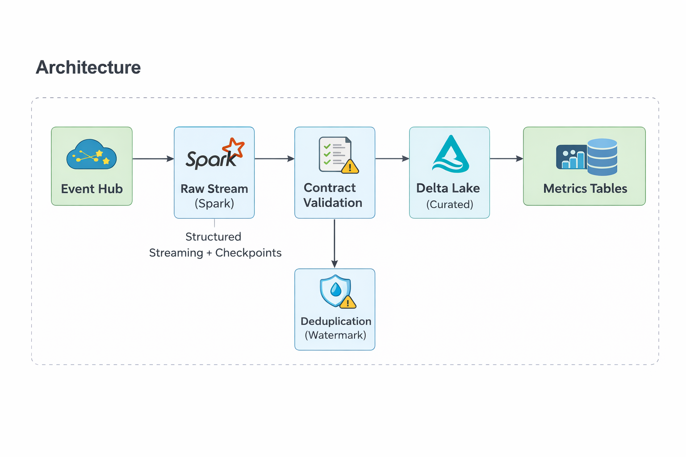
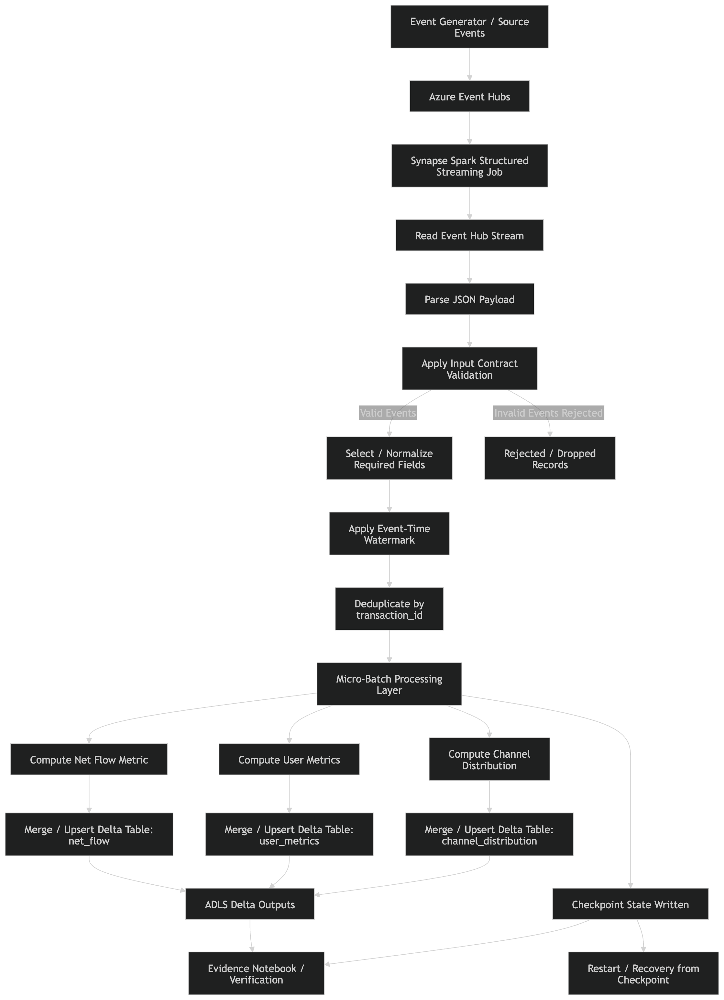

# Azure Event Stream — Real-Time Financial Metrics Pipeline


A production-grade streaming pipeline built on Azure Event Hubs, Spark Structured Streaming, and Delta Lake. It ingests synthetic financial transaction events in real time, validates them against a strict data contract, deduplicates across batches, and publishes three incremental metrics to Delta tables every 30 seconds.

Built as a portfolio project to demonstrate real streaming engineering judgment — not tutorial work.

---

## What This Is

An end-to-end streaming data product that does exactly three things well:

- Ingests transaction events from Azure Event Hubs continuously
- Enforces a data contract on every event before it touches any metric
- Publishes three ACID-safe, incrementally updated metrics to Delta Lake

The scope is intentionally narrow. The depth is intentionally real.

---

## Architecture


Pipeline flow:

Event Generator / Source  
→ Azure Event Hubs ingestion  
→ Synapse Spark Structured Streaming job  
→ JSON event parsing  
→ Contract validation and rejection rules  
→ Event-time watermarking and deduplication  
→ Streaming metric computation  
→ Delta Lake publication in ADLS  
→ Checkpoint-backed restart recovery  
→ Evidence notebook inspection


---

## Quick Proof of Correctness

This system guarantees correctness through deterministic processing, contract enforcement, and idempotent state updates.

**Core Proof Points**

- **Contract-first validation:** All incoming events are validated against schema and domain rules (R010–R120). Invalid events are rejected before processing.
- **Deterministic streaming:** Micro-batch execution with checkpointing ensures consistent state recovery and replay safety.
- **Duplicate protection:** Watermark-based deduplication prevents double counting from late or repeated events.
- **Idempotent metrics:** Delta Lake MERGE operations ensure aggregates update safely without overwrite risks.
- **Auditability:** Evidence notebooks allow independent verification of processing outcomes.

The project includes a dedicated **Evidence Notebook** demonstrating validation results, metric consistency checks, and run-level audit proof.

---

# What Is Implemented

## Contract Validation

Every event is validated before it reaches any metric. Invalid events are silently filtered — they never touch the output tables.

Validation rules enforced:

| Rule | Check |
|-----|------|
| R010 – R080 | Null check on all 8 required fields |
| R090 | `event_type` must be `deposit_completed` or `withdrawal_completed` |
| R100 | `channel` must be `web`, `mobile`, or `api` |
| R110 | `currency` must be `GBP` |
| R120 | `amount` must be greater than zero |

Stable rule IDs make failures traceable and consistent across versions.

---

## Watermark-Based Deduplication

Event Hubs delivers **at-least-once**. The same `event_id` can arrive in later batches. A simple `dropDuplicates()` within a single batch does not solve this.

This pipeline uses Spark's watermark state store:

```python
valid_stream \
    .withWatermark("event_time", "1 day") \
    .dropDuplicates(["event_id"])
```

Spark tracks seen `event_id` values across batches within the watermark horizon and drops anything already processed.  
The state is bounded — once the watermark horizon passes, Spark evicts old IDs automatically.

---

# Published Metrics

## M1 — Net Flow  
`metrics/net_flow/`

Global cumulative totals for deposits and withdrawals.

```
total_deposits
total_withdrawals
net_flow
deposit_count
withdrawal_count
avg_deposit
avg_withdrawal
deposit_to_withdrawal_ratio
updated_at
```

Updated via **Delta MERGE on a constant key**, ensuring atomic updates and safe retries.

---

## M2 — User Metrics  
`metrics/user_metrics/`

Per-user running totals.

```
user_id
total_deposits
total_withdrawals
deposit_count
withdrawal_count
first_seen
last_seen
updated_at
```

Upserted using **Delta MERGE**. New users are inserted, existing users accumulate totals.

---

## M3 — Channel Distribution  
`metrics/channel_distribution/`

Running counts grouped by `(channel, event_type)`.

```
channel
event_type
event_count
total_amount
updated_at
```

Maximum of six rows (3 channels × 2 event types).

---

# Checkpoint Recovery

All streaming state is persisted to ADLS.

Checkpoint includes:

- Event Hub offsets
- Watermark and deduplication state
- Batch metadata

If the stream fails, Spark resumes from the last checkpoint.

At most **one micro-batch may replay**, but Delta MERGE guarantees the metrics remain correct.

---

# Project Structure

```
src/
├── contracts/
│   ├── input_contract.py
│   └── output_contract.py
│
└── streaming/
    ├── stream_processor.py
    └── aggregations.py
```

---

# Design Decisions

## Why Micro-Batching Instead of Continuous Streaming

Micro-batching (30 second trigger) gives atomic commits per batch.

Each batch either:

- fully succeeds  
or  
- fully fails

Continuous streaming is harder to debug and reason about for financial metric pipelines.

Correctness matters more than sub-second latency.

---

## Why Watermark Dedup Instead of a Seen-Events Table

Alternative approach:

Maintain a Delta table of processed `event_id` values.

Problems:

- table grows forever
- requires cleanup jobs
- extra infrastructure

Watermark dedup uses Spark's built-in state store and automatically bounds memory usage.

---

## Why Delta MERGE for Metrics

Overwrite approaches risk corruption under retries.

Example failure scenario:

Two retries read the same old value and both update totals.

Delta MERGE guarantees **atomic row updates**.

State remains consistent regardless of retry count.

---

# Generator Characteristics

The synthetic event generator produces:

- ~100 events per second
- ~500 active users
- Channels: `web`, `mobile`, `api`
- Currency: `GBP`
- Amount range: £5 – £500
- Event types: `deposit_completed`, `withdrawal_completed`

This controlled simulation allows the pipeline to demonstrate realistic streaming behavior.

---

# How to Run (Azure Synapse)

## Prerequisites

- Azure Event Hubs namespace
- Event hub named `transactions`
- Azure Data Lake Storage Gen2 container `data`
- Azure Synapse Spark pool
- Event Hub connection string stored in Azure Key Vault

---

## 1. Start Event Generator (Local)

Install dependencies:

```bash
pip install azure-eventhub python-dotenv
```

Create `.env`

```
EVENT_HUB_CONNECTION_STRING=Endpoint=sb://<namespace>.servicebus.windows.net/...
EVENT_HUB_NAME=transactions
```

Run generator:

```bash
python produce_events.py
```

The generator emits ~100 events per second.

---

## 2. Upload Deployment Bundle to ADLS

Upload the code bundle:

```
abfss://data@<storage_account>.dfs.core.windows.net/code/azure_stream_code.zip
```

---

## 3. Run Stream in Synapse Notebook

Open a Synapse notebook attached to a Spark pool and run:

```python
from notebookutils import mssparkutils
from pyspark.sql import SparkSession

spark = SparkSession.builder.getOrCreate()

spark.sparkContext.addPyFile(
    "abfss://data@<storage_account>.dfs.core.windows.net/code/azure_stream_code.zip"
)

connection_string = mssparkutils.credentials.getSecret("<keyvault_name>", "<secret_name>")

from src.streaming.stream_processor import run_stream

run_stream(
    spark=spark,
    connection_string=connection_string,
    event_hub_name="transactions",
    output_path="abfss://data@<storage_account>.dfs.core.windows.net/stream",
    checkpoint_path="abfss://data@<storage_account>.dfs.core.windows.net/checkpoints",
    trigger_seconds=30,
    max_partitions=4,
    write_curated=False,
)
```

---

## Output Locations

```
abfss://data@<storage_account>.dfs.core.windows.net/

stream/
 └── metrics/
     ├── net_flow/
     ├── user_metrics/
     └── channel_distribution/

checkpoints/
```

---

## Stopping the Stream

Interrupt the notebook execution.

Checkpoint ensures safe restart with no duplication.

---

# Evidence

Execution verification is provided in:

```
evidence/EvidenceNB.ipynb
```

The notebook validates:

- metric invariants
- cross-table consistency
- streaming state progression
- checkpoint integrity

---

# Automated Testing

Unit tests validate:

- input contract enforcement
- aggregation correctness
- smoke test for metric pipeline

Run locally:

```bash
pytest -q
```

CI runs these tests automatically on every commit.

---

# What This Project Demonstrates

- Azure Event Hubs ingestion
- Spark Structured Streaming engineering
- Contract-first streaming validation
- Watermark-based deduplication
- Delta Lake MERGE-based incremental metrics
- Checkpoint-based failure recovery
- Clean separation between contracts, aggregations, and execution logic
- Real streaming engineering trade-off reasoning

---

# Portfolio Context

This repository represents the **Azure Streaming** component of a four-stage data engineering portfolio:

1. Local Batch Pipeline  
2. Local Streaming Pipeline  
3. Azure Batch Pipeline  
4. Azure Streaming Pipeline  

Each project demonstrates progressively more advanced data pipeline architectures while maintaining consistent engineering discipline.
